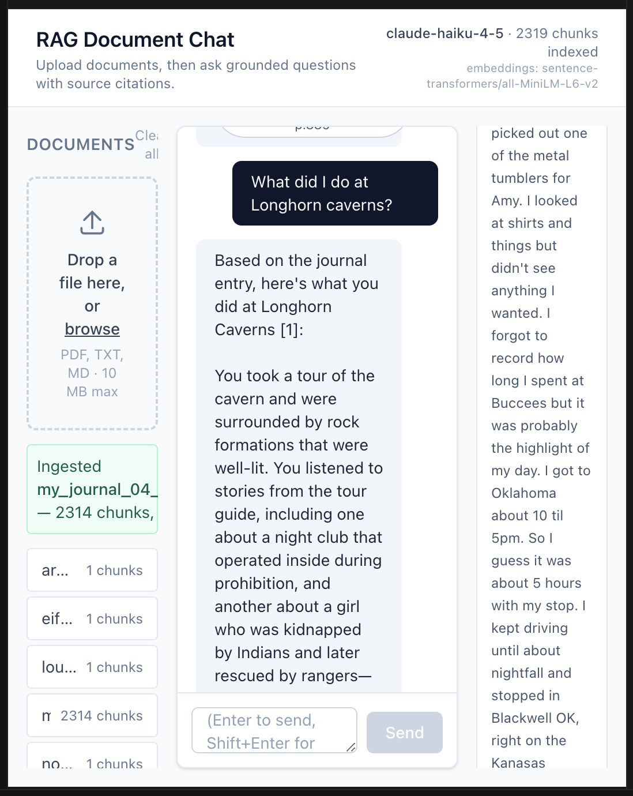
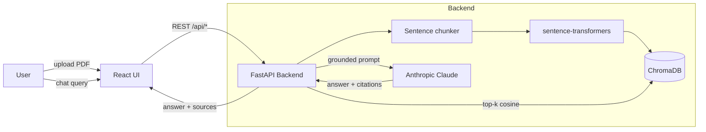
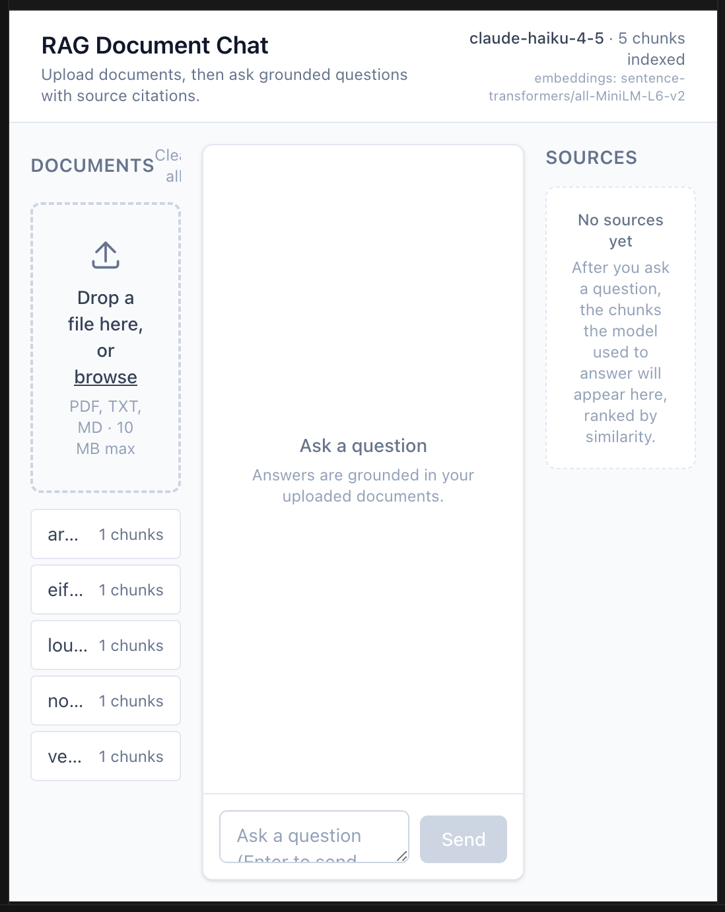

# RAG Document Chat

> Upload your documents, then chat with them. Answers are grounded in real source text and every claim is cited back to a specific chunk.

A from-scratch retrieval-augmented generation (RAG) application. The interesting parts are not the LLM call &mdash; they are the choices around chunking, embedding, retrieval scoring, prompt grounding, and citation UX.



## What this project demonstrates

- **End-to-end RAG pipeline** built without LangChain &mdash; every step is visible and explainable
- **Token-aware sentence-boundary chunking** that respects the embedder's context window
- **Local embeddings + local vector store** &mdash; zero per-query cost on the retrieval side
- **Grounded LLM prompting** with explicit citation format and "I don't know" refusal behavior
- **Real test coverage**: 25 tests including 4 live calls to the Anthropic API
- **Polished React UI** with drag-and-drop upload, click-to-cite source pills, and color-coded relevance scores
- **Deploy-ready architecture**: stateless API, env-driven config, bring-your-own embeddings

## Tech Stack

| Layer | Choice | Why |
|---|---|---|
| Backend | FastAPI + Python 3.11+ (uv-managed) | Type-checked, async, automatic OpenAPI docs |
| Embeddings | `sentence-transformers/all-MiniLM-L6-v2` (384-dim) | Free, runs on CPU, well-known baseline |
| Vector store | ChromaDB persistent client | No external infrastructure, real cosine search |
| LLM | Anthropic Claude (`claude-haiku-4-5` default) | Fast, cheap, strong instruction-following |
| Frontend | Vite + React 19 + TypeScript + Tailwind v4 | Modern tooling, sub-second HMR |
| Tests | pytest (mocked + live) | Fast unit tests + verified real API behavior |

## Architecture



For the deeper write-up &mdash; chunking strategy, scoring math, prompt design, and known limitations &mdash; see [docs/architecture.md](docs/architecture.md).

## Quick Start

You'll need:
- [uv](https://github.com/astral-sh/uv) (handles Python install automatically)
- Node.js 20+ (`brew install node` on macOS)
- An [Anthropic API key](https://console.anthropic.com)

```bash
# 1. Backend
cd backend
cp .env.example .env                     # edit .env: paste your ANTHROPIC_API_KEY
uv sync                                  # installs Python 3.11 + all deps
uv run uvicorn app.main:app --reload     # serves http://127.0.0.1:8000

# 2. Frontend (in a second terminal)
cd frontend
npm install
npm run dev                              # opens http://localhost:5173
```

Drag a PDF or text file from `examples/` (or your own) into the left panel, then ask questions about it.



## Try it without any setup

The `examples/` folder contains a few short text files you can upload immediately to see the system in action:

- `paris_landmarks.txt` &mdash; tests retrieval and refusal across many similar facts
- `rag_intro.txt` &mdash; tests the system answering questions *about* RAG
- `grace_hopper.txt` &mdash; tests single-document factual recall

Sample question for `paris_landmarks.txt`:
> "Which Paris landmarks were completed in the 1800s?"

Expected behaviour: Claude pulls only the Eiffel Tower (1889) and Arc de Triomphe (1836), correctly ignoring Notre-Dame (1345) and the Louvre (1793). Source chips at the bottom of the answer let you jump to the exact passages used.

## Key Design Decisions

The full discussion is in [docs/architecture.md](docs/architecture.md). Summary:

1. **Chunk size = 200 tokens, overlap = 30 tokens.** The embedder's max input is 256 tokens; going over silently truncates. 200 leaves headroom and produces chunks that read coherently.
2. **Sentence-boundary chunking** rather than fixed-width slicing. Avoids cutting mid-thought, which hurts both embedding quality and human readability of citations.
3. **L2-normalized embeddings + cosine distance.** Cosine on normalized vectors is mathematically equivalent to dot product but lets ChromaDB use its standard cosine index.
4. **Bring-your-own embeddings to Chroma.** A no-op embedding function is registered with the collection so we always pass embeddings explicitly. Keeps embedding choice fully under our control.
5. **Numbered citation contract** in the system prompt. Each retrieved chunk is prefixed with `[N] (source: filename, p.N)`, and Claude is instructed to cite using the same `[N]` markers. Makes citations verifiable in the UI.
6. **Explicit refusal instruction** &mdash; if the context doesn't answer the question, the model must say so verbatim. Tested with a live integration test.
7. **Singleton model + Chroma client** via `lru_cache` to avoid reloading PyTorch weights on every request.
8. **Score normalization**: cosine distance &rarr; similarity = `1 - distance`, displayed as a 0&ndash;1 score with green/amber/gray relevance bands in the UI.

## How this compares to NotebookLM

NotebookLM is the most familiar RAG product right now, but its design tradeoffs are nearly **inverted** from this project's:

- **NotebookLM**: big LLM (Gemini, 1M+ context) &rarr; big chunks &rarr; light retrieval. Mostly stuffs sources into the prompt directly.
- **This project**: small LLM (Claude Haiku, 200K context) &rarr; small chunks (200 tokens) &rarr; tight top-4 retrieval.

Both are valid &mdash; chunking strategy is downstream of context budget. Going small forces you to make every retrieval choice explicit and visible, which is also why the citations here are precise enough to highlight a single passage. See [docs/architecture.md &sect;10](docs/architecture.md#10-how-this-compares-to-notebooklm) for the full comparison and [&sect;11](docs/architecture.md#11-improving-retrieval--context) for the concrete upgrade path (re-ranking, hybrid search, HyDE, parent-document retrieval, long-context swap, etc.).

## Testing

```bash
cd backend
uv run pytest -v
```

The suite has 25 tests in 4 files:

| File | What it covers | Live API? |
|---|---|---|
| `test_ingest.py` | PDF + text parsing, chunking, embedding storage | No |
| `test_retrieve.py` | Semantic ranking, score range, metadata roundtrip, edge cases | No |
| `test_generate.py` | Prompt construction, citation behavior, grounded answers, refusal | 3 live |
| `test_api.py` | All HTTP endpoints, validation, error paths, full pipeline | 1 live |

Live tests automatically skip when `ANTHROPIC_API_KEY` is not set, so the suite stays green for anyone cloning the repo.

## Project Structure

```
01-rag-document-chat/
├── backend/
│   ├── app/
│   │   ├── main.py          # FastAPI app + routes + lifespan
│   │   ├── ingest.py        # parse → chunk → embed → store
│   │   ├── chunking.py      # sentence-aware token chunker
│   │   ├── embeddings.py    # sentence-transformers singleton
│   │   ├── vector_store.py  # ChromaDB persistent client
│   │   ├── retrieve.py      # semantic search → scored chunks
│   │   ├── generate.py      # grounded Claude prompting
│   │   ├── schemas.py       # Pydantic request/response models
│   │   └── config.py        # pydantic-settings env loader
│   ├── tests/               # 25 tests (4 live)
│   ├── pyproject.toml
│   └── .env.example
├── frontend/
│   ├── src/
│   │   ├── App.tsx          # 3-pane shell + chat state
│   │   ├── api/client.ts    # typed fetch wrappers
│   │   ├── types.ts         # mirrors backend Pydantic models
│   │   └── components/
│   │       ├── UploadPanel.tsx   # drag-and-drop + status banners
│   │       ├── ChatPanel.tsx     # bubbles, input, source pills
│   │       └── SourcesPanel.tsx  # ranked chunks, scores, jump-to highlight
│   ├── package.json
│   └── vite.config.ts       # Tailwind v4 + /api proxy
├── docs/
│   └── architecture.md      # deeper technical writeup
├── examples/                # sample docs you can upload
├── screenshots/             # README images
└── README.md
```

## Roadmap / Out of Scope (intentionally)

- Streaming token-by-token responses
- Multi-turn conversation memory
- Multi-tenant data isolation / auth
- Docker + Fly.io / Railway deployment
- Re-ranking step (cross-encoder over the top-k)
- Hybrid search (BM25 + dense)
- Larger embedding model with bigger context window

These are deliberate cuts to keep the project tight and reviewable. Several would make natural follow-up commits.

## License

MIT &mdash; see source for details.
