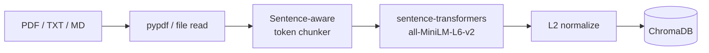

# Architecture & Design Decisions

This document explains _why_ the system is built the way it is, and what the alternatives would have been. The top-level [README](../README.md) covers what it does and how to run it.

## 1. The two pipelines

A RAG system is really two cooperating pipelines.

### Ingest (write path)



### Query (read path)

```mermaid
flowchart LR
    Q[User question] --> EmbedQ[Embed query]
    EmbedQ --> Search[ChromaDB<br/>cosine top-k]
    Search --> Score[distance → similarity]
    Score --> Prompt[Build system + user<br/>prompt with [N] markers]
    Prompt --> Claude[Anthropic Claude]
    Claude --> Answer[Answer with [N] citations]
    Answer --> UI[UI renders pills →<br/>click jumps to source]
```

The interesting choices live at the boundaries: chunking, scoring, and the prompt contract.

## 2. Chunking strategy

**Choice:** sentence-boundary chunks of ~200 tokens with ~30 tokens of overlap.

The naive baseline is fixed-width slicing &mdash; e.g. every 500 characters. That's bad for two reasons:

1. **It cuts mid-sentence.** Embeddings of half-sentences are noisier and citations look ugly in the UI ("...the protocol assumes that all messages a").
2. **It ignores the embedder's token budget.** `all-MiniLM-L6-v2` has a hard 256-token max input. Anything longer is silently truncated by the tokenizer, meaning the latter half of an oversized chunk contributes _nothing_ to the embedding but is still returned at retrieval time.

The implementation in `app/chunking.py`:

1. Splits the document into sentences using a lightweight regex (`(?<=[.!?])\s+`). Good enough for English prose; would swap for `pysbd` or a real tokenizer for production.
2. Greedily packs sentences into a chunk while measuring tokens with the embedder's own tokenizer.
3. When adding a sentence would exceed `chunk_size` (200), starts a new chunk.
4. Maintains `chunk_overlap` (30 tokens) of trailing context from the previous chunk so a query that spans a chunk boundary still has a reasonable chance of matching both.

**What I'd add for v2:** semantic chunking (cluster adjacent sentences by embedding similarity) or a sliding window over Markdown headings.

## 3. Embeddings

**Choice:** `sentence-transformers/all-MiniLM-L6-v2`, L2-normalized.

| Property | Value |
|---|---|
| Output dim | 384 |
| Max input | 256 tokens |
| Speed | ~14k sentences/sec on CPU |
| Cost | $0 (runs locally) |

This is the de facto baseline for "small, fast, decent quality." It's not state-of-the-art &mdash; an OpenAI `text-embedding-3-small` would beat it on most benchmarks &mdash; but:

- It's free per query (the LLM call is the only paid hop).
- It runs on a laptop without a GPU.
- It's a recognizable choice for reviewers.

The embeddings are L2-normalized in `app/embeddings.py` so cosine distance equals `1 - dot product`. This lets us use ChromaDB's standard cosine index without any custom math.

## 4. Vector store

**Choice:** ChromaDB persistent client, configured for cosine distance.

Why not Pinecone / Weaviate / Qdrant?

- Zero infrastructure for the demo &mdash; data lives in `./chroma_data/` as SQLite + parquet.
- Real cosine search with HNSW indexing, not a toy.
- The same Python API works against a hosted Chroma later if needed.

One nuance: Chroma _wants_ to own the embedding function. We override that with a no-op embedder (`app/vector_store.py`):

```python
class _NoopEmbeddingFunction(EmbeddingFunction[Documents]):
    def __call__(self, _: Documents) -> Embeddings:
        raise RuntimeError(
            "embeddings must be supplied explicitly via add(embeddings=...)"
        )
```

This guarantees we always pass embeddings explicitly and prevents Chroma from quietly downloading and using its default model behind our back.

## 5. Retrieval

`app/retrieve.py` does three things:

1. Embed the query (single forward pass through the same `all-MiniLM-L6-v2` model).
2. Call `collection.query(query_embeddings=..., n_results=top_k)` &mdash; default `top_k=4`.
3. Convert ChromaDB's cosine **distance** back into a more intuitive **similarity** score:

```python
similarity = 1.0 - distance
```

That gives `[0.0, 1.0]` where 1.0 is identical and 0.0 is orthogonal. The UI then bins this into:
- `> 0.5`: green "strong match"
- `0.35 – 0.5`: amber "partial match"
- `< 0.35`: gray "weak match"

These thresholds are calibrated empirically against `all-MiniLM-L6-v2`. A different embedder would need recalibration.

## 6. Grounded prompting

This is the part most RAG demos get wrong.

Two failure modes to design against:

1. **Hallucination.** The model invents facts that "sound right" but aren't in the documents.
2. **Sycophancy.** The model answers the question even when there's no supporting context, because it doesn't want to disappoint.

The system prompt in `app/generate.py` addresses both:

```text
You are a careful assistant that answers questions using ONLY the
provided context. Rules:
1. Use only the information in the context. Never use outside knowledge.
2. If the context doesn't contain the answer, say exactly:
   "I don't have enough information in the provided documents to answer that."
3. Cite sources inline using the [N] markers from the context.
4. Be concise.
```

Each retrieved chunk is wrapped with a numbered marker:

```text
[1] (source: paris_landmarks.txt, p.1)
The Eiffel Tower was completed in 1889 for the World's Fair...

[2] (source: paris_landmarks.txt, p.1)
Notre-Dame Cathedral was completed in 1345...
```

Claude then writes answers like _"The Eiffel Tower was completed in 1889 [1]"_. The frontend parses `[N]` markers and renders them as clickable pills that highlight the corresponding source on the right.

There are 3 live tests in `tests/test_generate.py` that hit the real Claude API and verify:

1. A grounded answer correctly uses `[N]` citations.
2. The model **refuses** with the exact required string when the context is irrelevant.
3. The model doesn't leak outside knowledge even when the question is about a topic it definitely knows.

## 7. API surface

| Method | Path | Purpose |
|---|---|---|
| `GET` | `/health` | Live status, current model, indexed chunk count |
| `POST` | `/upload` | Multipart file upload &rarr; ingest pipeline |
| `POST` | `/chat` | `{question}` &rarr; `{answer, sources[]}` |
| `GET` | `/documents` | Per-source chunk counts |
| `DELETE` | `/documents` | Clear the entire collection |

Validation: 10 MB upload cap, allow-listed extensions (`.pdf`, `.txt`, `.md`), Pydantic-enforced request bodies.

CORS is env-driven (`ALLOWED_ORIGINS`) so the same code works for local dev and any deployment target.

Startup/shutdown uses FastAPI's modern `lifespan` context manager to (a) ensure the persist dir exists, (b) warm the Chroma collection, and (c) tidy temp upload files on exit.

## 8. Frontend

Three-pane layout:

```
┌──────────────┬──────────────────────────┬──────────────┐
│  Upload /    │  Chat                    │  Sources     │
│  Documents   │  • bubbles               │  • [N] pills │
│  • drag-drop │  • input + send          │  • scores    │
│  • banners   │  • source citation pills │  • flash hl  │
└──────────────┴──────────────────────────┴──────────────┘
```

Why a 3-pane layout instead of a single chat column? Because the value of citations only lands when you can _see_ them next to the conversation. Hiding sources in a popover lets the user forget to verify; showing them inline forces engagement.

Source identity is computed once via:

```ts
function sourceKey(c: RetrievedChunk): string {
  return `${c.metadata.source}::${c.metadata.page ?? '-'}::${c.metadata.chunk_index}`
}
```

This same key is used for React `key` props, deduplication when prepending newly cited chunks to the panel, and the click-to-highlight handler. Single source of truth for chunk identity across components.

## 9. Performance characteristics

Measured on an M1 MacBook Air:

| Operation | Latency |
|---|---|
| Embed one query | ~30 ms |
| Top-4 retrieval over 1000 chunks | <10 ms |
| Claude `claude-haiku-4-5` round-trip | 600&ndash;1200 ms |
| Full `/chat` request, end-to-end | ~1 s |
| Ingest a 20-page PDF | 2&ndash;4 s (one-time, dominated by PDF parse + embed) |

The embedder is loaded once on first request via `lru_cache` &mdash; the first query after server start pays a ~2 s warmup cost.

## 10. How this compares to NotebookLM

Google's NotebookLM is the most visible consumer RAG product right now, so it's a useful benchmark. The interesting thing isn't that it's "better" &mdash; it's that the design tradeoffs are nearly **inverted** from this project's. Looking at where they diverge clarifies why both are valid.

Both systems converge on the same surface behavior: ground every answer in user-provided sources, expose citations the user can verify, scale across multiple documents. They diverge sharply underneath.

| Dimension | This project | NotebookLM (best public guess) |
|---|---|---|
| LLM context window | ~200K (Claude Haiku 4.5) | 1M+ (Gemini 2.5 family) |
| Chunk size | 200 tokens, sentence-aware | Probably paragraph- or page-sized |
| Embeddings | 384-dim local MiniLM | Frontier proprietary model |
| Retrieval pressure | **Heavy** &mdash; context is the bottleneck | **Light** &mdash; source count is the bottleneck |
| Per-corpus limit | Practically unlimited | Capped (e.g. 50 sources per notebook) |
| Cost per query | Pennies (LLM call only) | Bundled in subscription |
| Hosting model | Bring-your-own | Fully hosted, opaque |

Google has not published NotebookLM's internals, but two observations make a hybrid retrieval-plus-long-context architecture extremely likely:

1. **Source totals exceed even Gemini's 2M-token window.** 50 sources of ~500K words each is well past any model's context budget. Beyond some threshold, retrieval is mandatory.
2. **Citations highlight specific passages.** To render that highlight, the system must track each claim back to a span of a specific document. That implies an indexed chunk/passage representation, even if the generation step itself sees long context.

The most informative part of the comparison is the **chunk size inversion**:

- A **200-token chunk** maximizes _precision_. The embedding represents one focused idea, so cosine ranking picks it out cleanly. The cost is fragmentation: an argument spread across three paragraphs gets split into three chunks that may not all retrieve together.
- A **page-sized chunk** maximizes _recall_. More content per retrieved unit, less risk of missing the relevant span. The cost is ranking quality: the embedding now represents many themes at once and gets pulled toward the average, so cosine search becomes blurrier.

You can afford the page-sized strategy when the LLM has 1M tokens of headroom to reason across many big chunks. You can't afford it when a top-4 retrieval has to fit alongside the system prompt and conversation history in 200K. **Chunking strategy is downstream of context budget &mdash; pick the chunker for the LLM you're using.**

This is why "RAG vs. long context" turned out to be the wrong framing in 2024&ndash;2026. Long context didn't kill retrieval; it just relaxed how aggressively you have to chunk and rank.

## 11. Improving retrieval & context

The current pipeline is deliberately minimal so each component is visible and testable. Here are the highest-leverage upgrades, grouped by what they actually fix. Roughly ordered by ROI: re-ranking and hybrid search are the cheapest wins.

### Retrieval quality
- **Cross-encoder re-ranking.** Pull `top_k=20` from Chroma, then re-score with a small cross-encoder like `bge-reranker-base` and keep the top 4. Cross-encoders see the query and chunk together in a single forward pass, so they catch nuance that bi-encoders (like our embedder) structurally can't. Adds ~50&ndash;100 ms.
- **Hybrid search.** Run BM25 over the same chunks alongside dense retrieval and merge with [reciprocal rank fusion](https://plg.uwaterloo.ca/~gvcormac/cormacksigir09-rrf.pdf). Especially helps on queries that quote the document's exact wording &mdash; proper nouns, code identifiers, error strings, dates &mdash; where dense embeddings tend to wash out the literal match.
- **HyDE / query expansion.** Use a cheap LLM call to turn "Tell me about Paris landmarks" into a hypothetical detailed answer, then embed _that_ for retrieval. The hypothetical answer matches the document's prose style much better than a terse question does.
- **Multi-query retrieval.** Have the LLM produce 3 paraphrases of the question, retrieve for each, union and dedupe. Smooths out variance from awkwardly phrased questions.
- **Stronger embedder.** Upgrade to `bge-large-en-v1.5` (1024-dim, still local) or `text-embedding-3-small` (1536-dim, hosted). Recalibrate the green/amber/gray relevance thresholds when you do &mdash; they're tuned to MiniLM today.
- **Semantic chunking.** Before slicing, cluster adjacent sentences by embedding similarity and split on weak boundaries. Produces chunks that respect topic transitions instead of arbitrary sentence counts.
- **Metadata extraction at ingest.** Have a small LLM call pull entities, dates, and topics per chunk and store them as Chroma metadata. Then filter at query time (`where={"topic": "architecture"}`) before semantic ranking.

### Context quality
- **Parent-document retrieval.** Index small (~200-token) chunks for precision, but at answer time pass the _parent paragraph or page_ to the LLM. Best of both worlds: tight ranking + roomy reasoning context.
- **Neighbor expansion.** When retrieving chunk N, also fetch N&minus;1 and N+1 from the same document. Cheap, mechanical fix for answers that straddle a chunk boundary.
- **Long-context LLM swap.** Move to Claude Sonnet 4.5 (1M tokens) or Gemini 2.5 Pro (2M tokens). With that headroom you can pass `top_k=20` raw and let the model do its own filtering &mdash; getting closer to the NotebookLM tradeoff.
- **Conversation memory + question rewriting.** Before retrieval, rewrite "what about its history?" into "what about the Eiffel Tower's history?" using prior turns. Today, follow-ups don't see the conversation at all.
- **Per-document scoping.** Let the user pin a document so retrieval only searches inside it. Avoids cross-document noise when they already know where the answer lives.
- **Citation faithfulness eval.** Add an LLM-judge step that scores whether each cited chunk actually supports the claim it's attached to. Catches the rare case where Claude cites a chunk that's only tangentially related.

### Operational
- **Streaming via SSE.** Token-by-token UI updates. The frontend is already structured to consume chunks.
- **Eval harness.** A fixed `(question, expected_citations)` set per sample document, run on every change. Currently I verify by hand.

## 12. What's intentionally _not_ here

- LangChain / LlamaIndex &mdash; the whole pipeline fits in ~600 lines of readable Python and there's nothing to gain by hiding it.
- An auth layer &mdash; this is a single-user demo. Adding auth without a real multi-tenant data model would just be cosplay.
- Docker &mdash; `uv` and `npm` give a fast enough dev loop; containerization is a deployment concern and lives in the roadmap.
